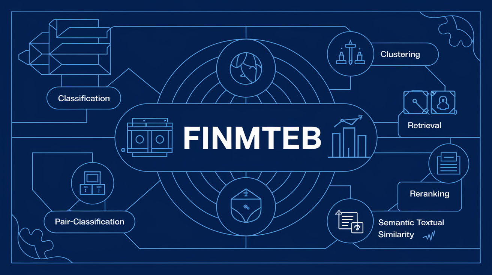

<div align="center">
    
</div>

# FinMTEB: Finance Massive Text Embedding Benchmark
Finance Massive Text Embedding Benchmark (FinMTEB), an embedding benchmark consists of **64 financial domain-specific text datasets**, across **English and Chinese**, spanning **seven different tasks**. All datasets in FinMTEB are finance-domain specific, either previously used in financial NLP research or newly developed by the authors.


## Usage 
* The basic pipeline is built upon [MTEB](https://github.com/embeddings-benchmark/mteb). 
  
### Install

```
conda create -n finmteb python=3.10
git clone https://github.com/yixuantt/FinMTEB.git
cd FinMTEB
pip install -r requirements.txt
```

### Task selection
FinMTEB offers 7 tasks and 64 datasets, which you can choose according to your needs.

```
import finance_mteb 

tasks = finance_mteb.get_tasks(task_types=["Clustering", "Retrieval","PairClassification","Reranking","STS","Summarization","Classification"]) # All 7 Tasks
```

### Running a Benchmark

```
from finance_mteb import MTEB
task = "FinSTS"
evaluation = MTEB(tasks=[task])
evaluation.run(model, output_folder=f"results/{model_name_or_path.split('/')[-1]}")
```

## Example Usage
* There is an example Python script for your reference:
```
python eval_FinanceMTEB.py --model_name_or_path BAAI/bge-en-icl --pooling_method last
```

## Citation
Coming Soon.
--------
Thanks to the [MTEB](https://github.com/embeddings-benchmark/mteb) Benchmark.
